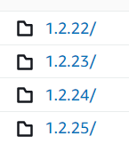

This is a simple example of an api that resolves federated module versions. The idea is to enable version change by configuration in runtime, rather than having to build and deploy the consumer of the module.

Note: express redirection is surely not the best way to do it. The purpose of this is just to demonstrate the concepts itself.

## demo

### use case
A new version of a federated module ("design-systrem") has been published at a cdn.
A consumer of that madule has tested this new version in TEST and UAT and is ready to start using it in PROD.

You want to change the version in use, without building or deploying.

### steps
1. install dependencies
`npm i`

2. start the server
`node server`

3. Visit the published consumer app: https://mf-consumer-jet.vercel.app/

4. Open the file _data\modules.json_ and update the value of _["design-system"]["consumers"]["mf-consumer"]["prod"]_ from `"1.2.24"` to `"1.2.25"`. Save. (No need to restart the server).

5. Reload the consumer app and see that the default style of the button changed

## srcs in use

[mf-module](https://github.com/ericrinaldo/mf-module), the "design-system" with the button component  
[mf-consumer](https://github.com/ericrinaldo/mf-consumer), the application consuming the button component

## cdn
